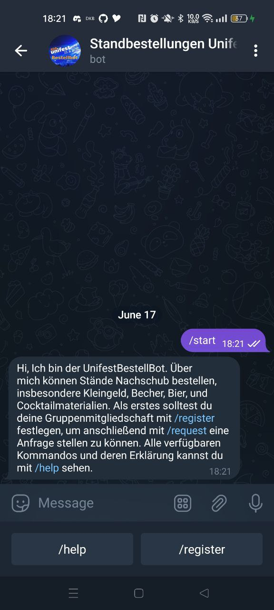
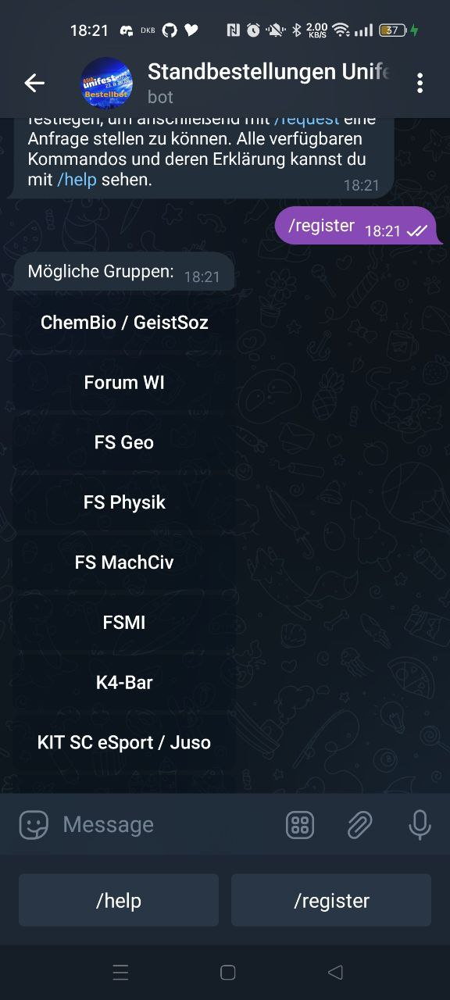
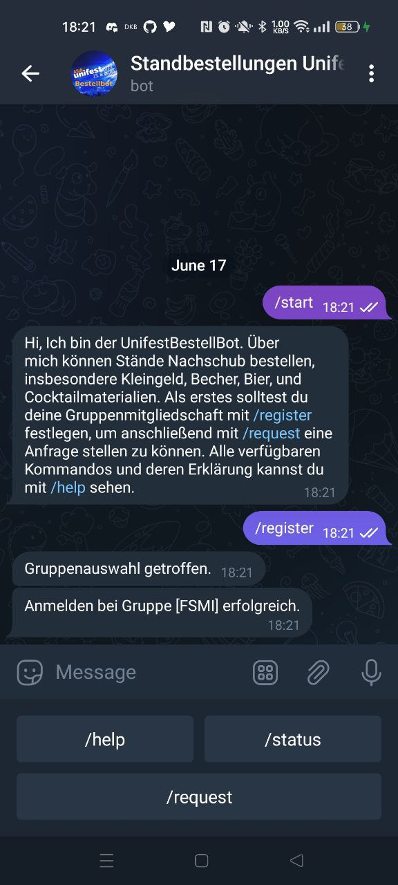
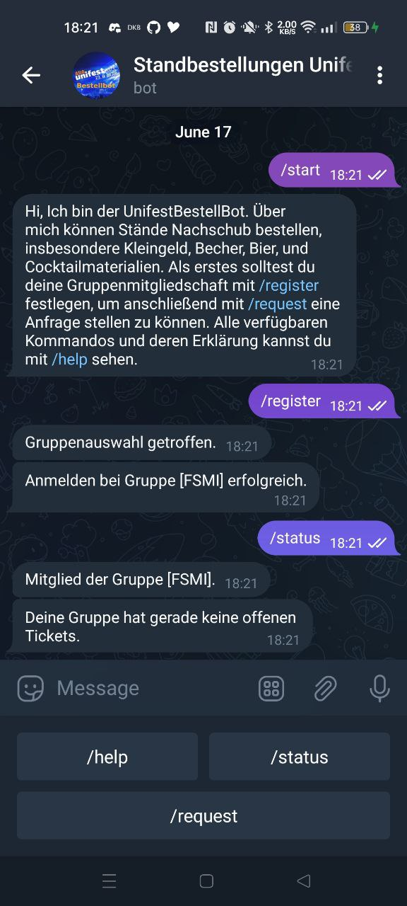
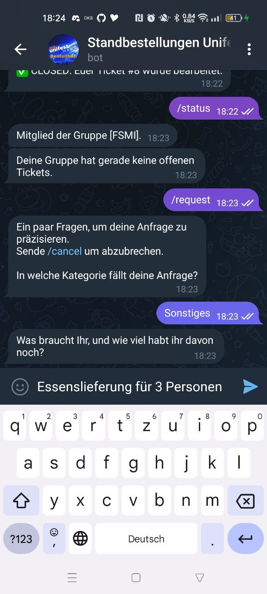
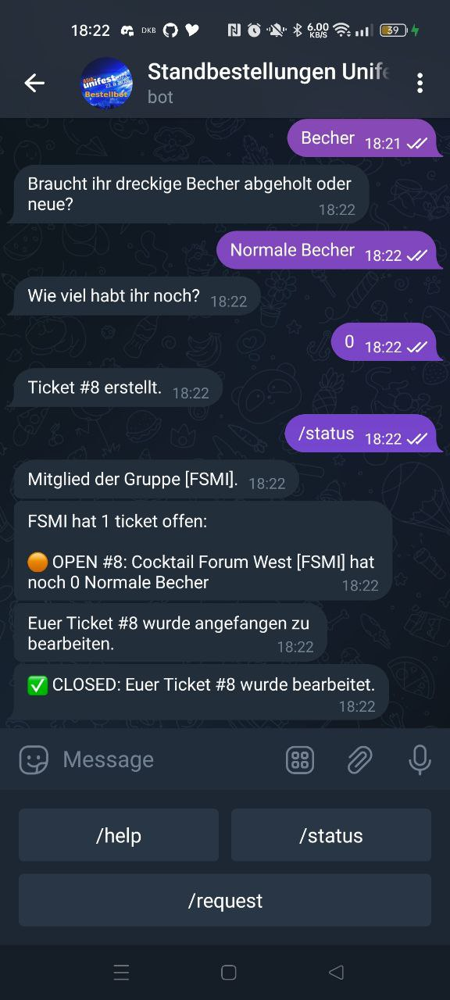
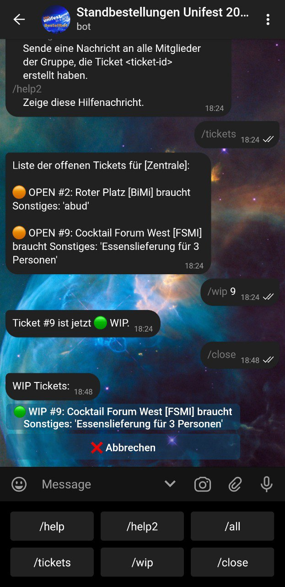
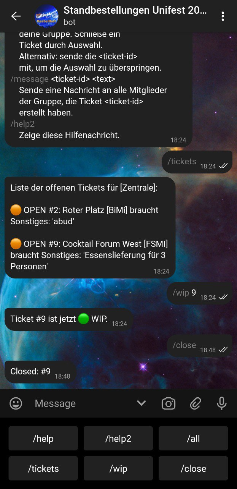
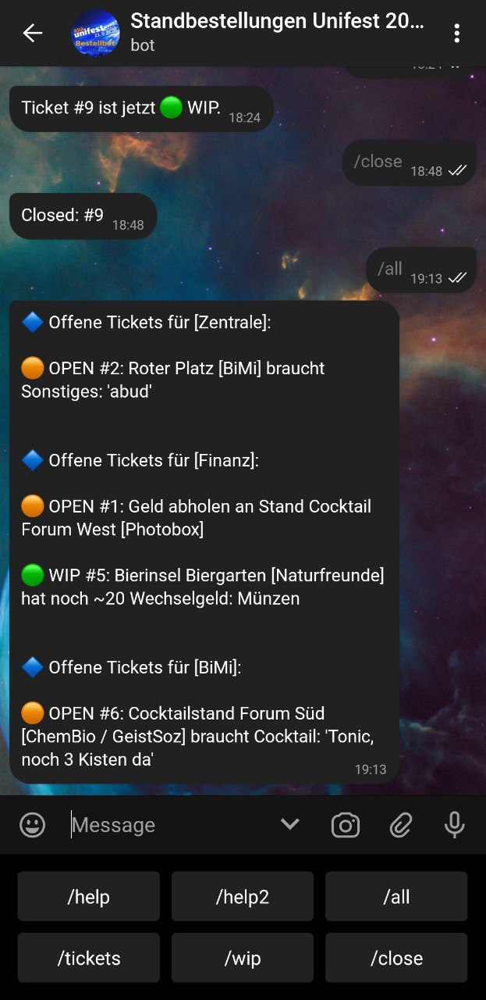

# @UnifestBestellBot

Telegram bot for stalls to order supplies such as drinks, cups or change at the unifest

## Usage

Package management is done via `uv`, you can [install uv according to the official documentation](https://docs.astral.sh/uv/getting-started/installation/) through `pipx install uv`, `curl -LsSf https://astral.sh/uv/install.sh | sh` or your package manager of preference.

After that, you can install dependencies with

```sh
> uv sync
```

Then, execute the following to run the bot:

```sh
> uv run main.py
```

See `-h` for help on arguments.

## Dashboard

There also is a simple MQTT-driven dashboard available. See [DASHBOARD.md](DASHBOARD.md) for
more information. If you do not want to run the dashboard, create `mqtt.json`,
containing only `{}`.

## Config

see configuration options in `lib/config.py`.
What you absolutely need is a directory for secrets, e.g. the list of groups,
but also the bot token, and ids for a managed channel or to notify the
developer.

## Demo

image1 | image2 | image3
:---:|:---:|:---:
  |   | 
 |  | 
 |  | 
