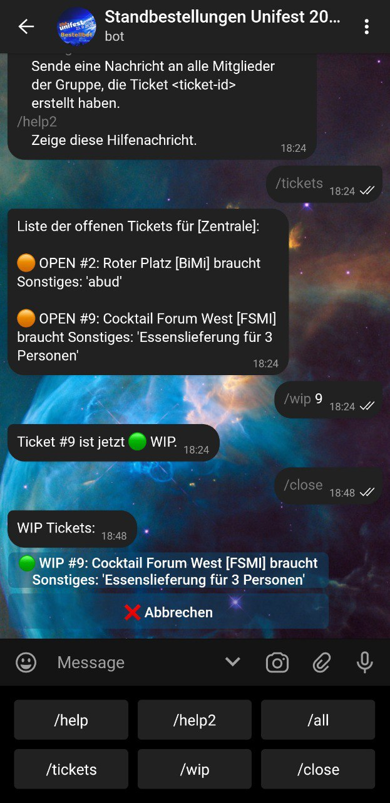

# @UnifestBestellBot
Telegram bot for stalls to order supplies such as drinks, cups or change at the unifest


## Usage
Package management is done via poetry, so we need:
- (a virtual environment)
- `poetry`
- `poetry` to install dependencies
```sh
> # install poetry
> pip install poetry
> # install dependencies
> poetry install
```

after that, execute
```sh
> poetry run python main.py
```
to run the program. See `-h` for help on arguments. Ensure you have a complete configuration first, though.

## Dashboard
There also is a simple MQTT-driven dashboard available. See [DASHBOARD.md]() for
more information. If you do not want to run the dashboard, create `mqtt.json`,
containing only `{}`.


## Config
see configuration options in `lib/config.py`.
What you absolutely need is a directory for secrets, e.g. the list of groups,
but also the bot token, and ids for a managed channel or to notify the
developer.

## Demo
image1 | image2 | image3
:---:|:---:|:---:
  |   | 
 |  | 
 |  | 

